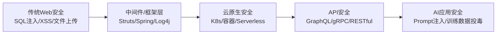
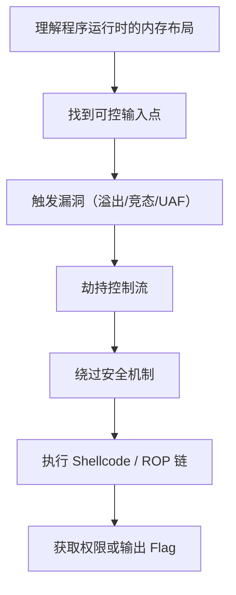
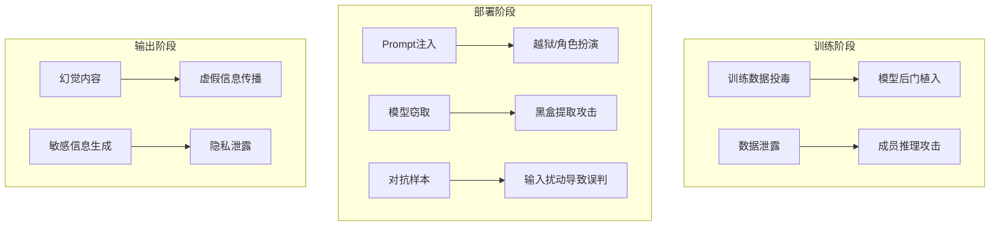
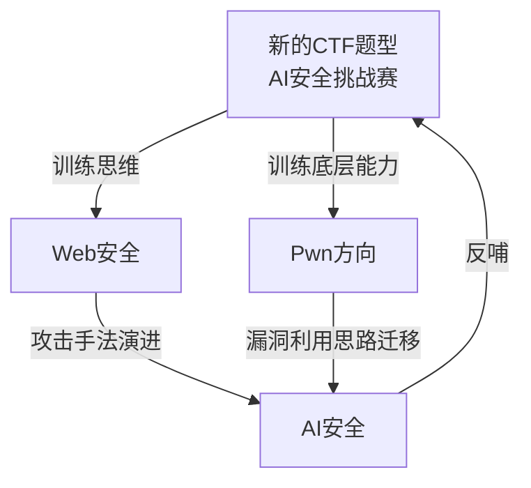

## 第一章：CTF 主要训练什么能力？

### 1.1 CTF 简介

CTF（Capture The Flag，夺旗赛）是网络安全领域最主流的竞技训练形式。参赛者通过破解漏洞、分析流量、逆向工程等手段获取“Flag”（通常是一段特定格式的字符串）来得分。

### 1.2 CTF 训练的核心能力矩阵

| 能力维度 | 具体内容 | 对应典型题型 |
|---------|---------|-------------|
| **漏洞挖掘能力** | 发现代码或系统中的安全缺陷 | Web、Pwn |
| **逆向分析能力** | 理解二进制程序逻辑，还原算法 | Reverse |
| **密码分析能力** | 识别弱加密、破解哈希、理解协议 | Crypto |
| **流量分析能力** | 从网络包中提取隐藏信息或攻击痕迹 | Misc、Forensic |
| **工具使用能力** | 熟练运用 Burp Suite、IDA Pro、Wireshark 等 | 全类型 |
| **快速学习能力** | 短时间内理解陌生技术栈并找到突破口 | 全类型 |
| **团队协作能力** | 分工配合、信息同步、接力解题 | 团队赛模式 |
| **抗压与韧性** | 长时间高强度的思考与试错 | 实赛环境 |

### 1.3 CTF 训练的本质

> **CTF 不是安全的全部，但它是安全能力的“健身房”。**

CTF 最大的价值不在于让你掌握某个具体漏洞的利用，而在于训练一种 **“攻击者思维”** ：

- 假设系统不可信，主动寻找异常点
- 从“功能”中看到“边界”，从“正常”中看到“越权”
- 面对黑盒时，通过行为反推内部逻辑

### 1.4 CTF 的局限性与补充建议

| 局限性 | 补充建议 |
|--------|----------|
| 题目环境过于理想化，与实际业务差距大 | 结合真实漏洞案例（CVE）学习 |
| 过度依赖“技巧性”而非“工程性” | 参与开源安全项目或 SRC 众测 |
| Flag 型目标单一，缺乏持续性威胁模拟 | 学习 APT 攻击链和红蓝对抗 |
| 容易陷入“刷题”而忽视原理 | 每道题完成后写 Write-up 复盘原理 |

---

## 第二章：Web 安全主要研究什么？

### 2.1 Web 安全的核心问题

Web 安全研究的是 **“在 HTTP/HTTPS 协议之上，所有用户可控输入点可能引发的安全问题”**。本质上，Web 安全的根因可以归结为一句话：

> **所有用户输入都是不可信的。**

### 2.2 主流 Web 漏洞类型及原理

| 漏洞类型 | 核心原理 | 经典案例 |
|---------|---------|----------|
| **SQL 注入** | 用户输入被拼接到 SQL 语句中，改变原语义 | ' OR '1'='1 |
| **XSS（跨站脚本）** | 用户输入被回显到 HTML 页面，执行恶意 JS | `<script>alert(1)</script>` |
| **CSRF（跨站请求伪造）** | 利用用户已登录状态，伪造跨站请求 | 图片 img 标签携带 GET 请求 |
| **SSRF（服务端请求伪造）** | 利用服务端发起请求，访问内网资源 | 修改 URL 参数为 127.0.0.1:80 |
| **文件上传漏洞** | 上传恶意文件（Webshell）并执行 | 绕过 MIME 检查、后缀黑名单 |
| **反序列化漏洞** | 反序列化不可信数据，触发任意代码执行 | PHP/Java 反序列化链 |
| **越权漏洞** | 水平/垂直越权，访问非授权资源 | 修改订单 ID 查看他人订单 |
| **信息泄露** | 错误信息、源码、备份文件暴露 | .git 泄露、debug 页面 |

### 2.3 Web 安全的演进趋势



### 2.4 Web 安全需要掌握的知识栈

- **协议层**：HTTP/HTTPS、TCP/IP、DNS、同源策略
- **开发层**：前端（HTML/CSS/JS）、后端（至少一种语言）、数据库（SQL/NoSQL）
- **框架层**：常见框架的安全特性与已知漏洞（如 Spring Security、Django、ThinkPHP）
- **工具层**：Burp Suite、Nmap、SQLMap、Metasploit、Fiddler
- **逻辑层**：认证、授权、会话管理、业务逻辑绕过

---

## 第三章：Pwn 方向为什么需要理解程序底层？

### 3.1 什么是 Pwn？

Pwn（谐音“own”，意为“控制”）方向主要研究 **二进制程序的安全漏洞挖掘与利用**，目标是让目标程序执行攻击者预设的任意代码或逻辑。

### 3.2 Pwn 需要理解的底层知识体系

| 知识模块 | 具体内容 | 为什么必须掌握 |
|---------|---------|---------------|
| **计算机组成原理** | CPU 架构、寄存器、内存寻址、缓存 | 理解程序执行的基本单元 |
| **操作系统原理** | 进程/线程管理、虚拟内存、系统调用 | 理解程序与 OS 的交互边界 |
| **编译原理** | 汇编语言、栈帧布局、调用约定 | 反汇编时必须读懂指令流 |
| **内存管理** | 堆/栈结构、内存分配器（ptmalloc）、页表 | 堆溢出/栈溢出的根本原理 |
| **保护机制** | ASLR、DEP/NX、Stack Canary、PIE、RELRO | 现代利用必须绕过这些机制 |
| **漏洞利用技术** | ROP（返回导向编程）、ret2libc、格式化字符串 | 实际利用的核心手段 |

### 3.3 一个典型 Stack Overflow 利用链的底层理解

```text
[攻击者输入] → [覆盖栈上返回地址] → [CPU 跳转到恶意地址]
      ↓
理解要点：
1. 栈是向下增长的，局部变量在栈顶
2. 返回地址保存在栈帧底部
3. 没有 Canary 保护时，溢出可以覆盖返回地址
4. 需要知道目标系统的 ABI 调用约定
5. 如果开启了 ASLR，需要信息泄露先获取地址
```

### 3.4 Pwn 方向的核心思维



### 3.5 为什么不能用“高级语言思维”做 Pwn？

高级语言（Java/Python/PHP）屏蔽了内存管理的细节，开发者不需要关心对象在内存中如何排列、栈帧如何分配。但 **Pwn 的核心就是操纵这些被屏蔽的细节**：

- 不理解栈布局，就无法精确控制偏移量
- 不理解堆管理策略，就无法利用 UAF（Use After Free）
- 不理解系统调用，就无法构造有效的 Shellcode

> **Pwn 的本质是“把程序当作数据”** —— 内存中的指令和普通数据没有区别，只要能控制指令指针，就等于控制了程序本身。

---

## 第四章：AI 安全和传统安全有什么区别？

### 4.1 核心区别一览表

| 对比维度 | 传统安全 | AI 安全 | 关键差异 |
|---------|---------|--------|----------|
| **攻击目标** | 系统、网络、应用、数据 | 模型本身、训练数据、推理结果 | 攻击面从“代码”延伸到“认知” |
| **漏洞成因** | 编码错误、配置失误、协议缺陷 | 模型不可解释性、数据偏差、概率输出 | 非确定性漏洞，难以复现 |
| **攻击手段** | 注入、溢出、绕过、欺骗 | Prompt注入、数据投毒、对抗样本、模型窃取 | 攻击不依赖代码执行 |
| **防御思路** | 补丁、WAF、IDS、最小权限 | 输入过滤、对抗训练、差分隐私、RAG | 防御从“规则”走向“统计” |
| **检测方式** | 特征匹配、行为审计 | 输出监控、概率异常检测、红线测试 | 难以定义“正常”边界 |
| **责任归属** | 开发/运维/安全团队责任明确 | 模型训练、数据标注、部署全链条 | 责任链条更长且模糊 |

### 4.2 AI 安全独有的攻击面



### 4.3 安全威胁模型对比

| 威胁模型 | 传统安全示例 | AI 安全对应示例 |
|---------|-------------|----------------|
| **机密性破坏** | SQL 注入窃取数据库 | 模型逆向攻击还原训练数据 |
| **完整性破坏** | 文件被篡改 | 对抗样本改变分类结果 |
| **可用性破坏** | DDoS 攻击 | 大量恶意请求耗尽 Token 配额 |
| **认证绕过** | 越权访问管理后台 | Prompt 越狱突破安全护栏 |
| **业务逻辑破坏** | 修改订单金额 | 诱导模型给出错误业务决策 |

### 4.4 防御范式的根本性转变

| 传统防御逻辑 | AI 安全防御逻辑 |
|-------------|----------------|
| 已知漏洞 → 打补丁 | 未知漏洞 → 红队持续测试 |
| 规则匹配 → 拦截 | 语义理解 → 内容审核 |
| 权限控制 → 最小化 | 行为约束 → 提示工程 |
| 签名检测 → 黑名单 | 异常检测 → 概率阈值 |
| 隔离网络 → 降低暴露面 | 限制上下文 → 防止数据泄露 |

### 4.5 AI 安全带来的新挑战

1. **不可解释性**：传统漏洞有明确的代码缺陷定位，AI 错误可能是模型权重层面的复杂纠缠，难以溯源。
2. **非确定性**：同一输入在不同时间/版本下可能产生不同输出，安全测试无法做到“确定性覆盖”。
3. **规模效应**：LLM 的上下文窗口和自由度极大，攻击面随输入长度指数增长。
4. **合规压力**：AI 监管（如 EU AI Act、中国《生成式人工智能服务管理暂行办法》）要求安全贯穿全生命周期。

---

## 第五章：整体复盘与个人成长反思

### 5.1 四者关联图


---

**最后感想**：网络安全是一条“学不完”的路，但正因为学不完，才更有持续探索的价值。到最后的复盘我也反思了和第一阶段考核的不同，第二阶段基本上每个知识点都要借助AI，更加不同的是第二阶段就算应用了非常多的AI也是半懂的状态，我也再一次的从CTF,Web,Pwn以及AI本身的概念出发，从整体的学习以及相关的做题来说的话我认为Web是相对难度比较大的，AIprompt是相对比较简单的，我目前对Pwn/二进制和CTF是比较感兴趣的，我认为两者的逻辑性是比较强的，但是在这两者中我仍然只是明白其中非常浅显的知识。
