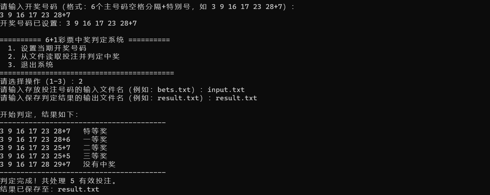
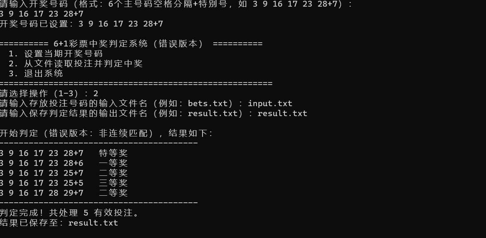
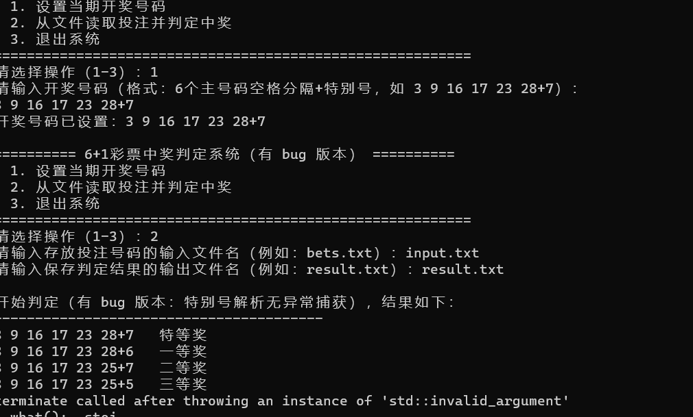

```markdown
# 栈溢出漏洞调试分析报告

## 一、实验环境

| 项目 | 信息 |
|------|------|
| 操作系统 | Kali Linux 2026.1（x86_64） |
| 内核版本 | 6.11.0-amd64 |
| 编译器 | GCC 17.2（Debian） |
| 调试器 | GDB 17.2（Debian） |
| 目标程序 | vuln（自定义 C 程序） |
| 漏洞类型 | 栈缓冲区溢出（Stack Buffer Overflow） |

---

## 二、目标程序源码（vuln.c）

```c
#include <stdio.h>
#include <stdlib.h>

void vulnerable() {
    char buffer[10];
    printf("输入一些内容：");
    gets(buffer);  // 不安全函数，存在栈溢出漏洞
    printf("你输入了：%s\n", buffer);
}

int main() {
    vulnerable();
    return 0;
}
```

---

## 三、编译配置

编译时关闭所有安全保护机制，保留调试符号：

```bash
gcc -g -no-pie -fno-stack-protector -z execstack -o vuln vuln.c -Wno-implicit-function-declaration
```

编译警告（忽略即可）：

```
/usr/bin/x86_64-linux-gnu-ld: warning: the 'gets' function is dangerous and should not be used.
```

---

## 四、GDB 调试过程

### 4.1 启动调试并设置断点

```bash
gdb ./vuln
(gdb) break main
(gdb) break vulnerable
```

输出：

```
Breakpoint 1 at 0x401185: file vuln.c, line 12.
Breakpoint 2 at 0x40113e: file vuln.c, line 6.
```

### 4.2 运行程序

```bash
(gdb) run
```

停在 `main` 函数处：

```
Breakpoint 1, main () at vuln.c:12
12    vulnerable();
```

### 4.3 进入 vulnerable 函数

```bash
(gdb) continue
```

停在 `vulnerable` 函数入口：

```
Breakpoint 2, vulnerable () at vuln.c:6
6    printf("输入一些内容：");
```

### 4.4 执行到 gets 调用

```bash
(gdb) next
7    gets(buffer);
```

### 4.5 输入超长测试字符串

在程序提示输入时，输入 200+ 字节的测试数据：

```
AAAAAAAAAAAAAAAAAAAAAAAAAAAAAAAAAAAAAAAAAAAAAAAAAAAAAAAAAAAAAAAAAAAAAAAAAAAAAAAAAAAAAAAAAAAAAAAAAAAAAAAAAAAAAAAAAAAAAAAAAAAAAAAAAAAAAAAAAAAAAAAAAAAAAAAAAAAAAAAAAAAAAAAAAAAAAAAAAAAAAAAAAAAAAAAAAAAAAAAABBBBCCCCDDDD
```

程序崩溃：

```
Segmentation fault (core dumped)
```

### 4.6 查看崩溃时的指令指针（rip）

```bash
(gdb) info registers rip
```

关键输出：

```
rip    0x44444444    0x44444444
```

说明返回地址已被 `"DDDD"`（0x44）覆盖。

### 4.7 查看返回地址存储位置

```bash
(gdb) x/gx $rbp + 8
```

输出：

```
0x7fffffffdd38: 0x0000000000401191
```

该地址为 `main` 调用 `vulnerable` 后的返回地址。

### 4.8 查看关键寄存器

```bash
(gdb) info registers
```

关键值：

```
rbp    0x7fffffffdd30
rsp    0x7fffffffdd10
rip    0x44444444
```

### 4.9 查看栈内存布局

```bash
(gdb) x/40gx $rsp
```

部分输出：

```
0x7fffffffdd10: 0x000000a41414141    0x0000000000000000
...
0x7fffffffdda0: 0x44444444            0x43434343
```

说明：
- `0x41414141` = `"AAAA"`（填充数据）
- `0x43434343` = `"CCCC"`（填充数据）
- `0x44444444` = `"DDDD"`（覆盖返回地址）

---






## 五、关键数据计算

| 项目 | 地址 / 值 |
|------|-----------|
| buffer 起始地址 | `0x7fffffffdd10` |
| rbp（栈帧基址） | `0x7fffffffdd30` |
| 返回地址存储位置 | `0x7fffffffdd38`（= rbp + 8） |
| 覆盖后的 rip 值 | `0x44444444`（"DDDD"） |
| buffer 到返回地址偏移量 | `0x7fffffffdd38 - 0x7fffffffdd10 = 0x28 = 40 字节` |

**验证结果：**
- 输入前 40 字节为 `"A"*40`
- 之后 4 字节为 `"DDDD"`
- 成功覆盖返回地址，偏移量为 **40 字节**

---

## 六、漏洞利用要点

1. **溢出点**：`gets(buffer)` 未限制输入长度，可超出 `buffer[10]` 边界写入数据。
2. **偏移量**：需填充 **40 字节** 垃圾数据，然后覆盖返回地址（8 字节）。

---

## 七、结论

- `vuln` 程序存在栈溢出漏洞。
- 从 `buffer` 起始到返回地址的偏移量为 **40 字节**。

---

**调试工具**：GDB 17.2 / Kali Linux 2026.1  
**记录时间**：2026-08-29  
```

---
